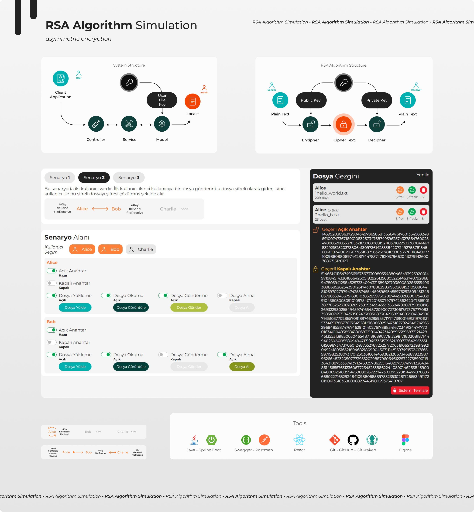

# RSA Cryptography Algorithm Simulation


***Asymmetric Encryption***

RSA (Rivest-Shamir-Adleman) is an asymmetric encryption algorithm that uses two different keys: a public key and a private key. Data encrypted with the public key can only be decrypted by the corresponding private key. This makes RSA ideal for secure data transmission, digital signatures, and authentication.

*In this project, RSA encryption is used to encrypt files in various scenarios. The backend is developed with Java Spring Boot to handle the API, and the frontend uses React to simulate and provide a user interface for encrypting and decrypting files, allowing users to interact with the encryption process in real-time.*




### Scenario/3 gif


### Installation
```sh
git clone https://github.com/zahidayturanrsa-cryptography-algorithm-example.git
cd rsa-cryptography-algorithm-example

cd rsa-backend
mvn clean install

Edit the rsa-backend/src/main/resources/application.properties file according to your own information

cd ../rsa-frontend
npm install

Create and edit the rsa-frontend/.env file as follows:
REACT_APP_API_BASE_URL=http://localhost:8080 (probably)

cd rsa-backend
mvn spring-boot:run

cd ../rsa-frontend
npm start

Visit http://localhost:3000 in your browser to explore RSA.
```
If you encounter any issues during setup, please report an issue. Feel free to adjust any placeholders or specific details as needed!


## How can I support developers?
- Star this GitHub repo
- Create pull requests, submit bugs, suggest new features or documentation updates
- Follow my work